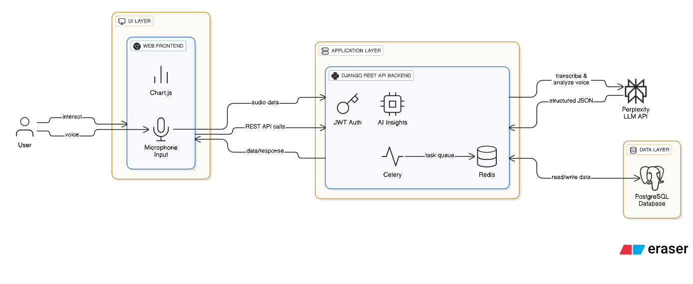

# 🐄 FarmSense — AI-Powered Livestock Management System

**FarmSense** is a full-stack web application designed to simplify livestock management with the power of **Generative AI**.  
It enables users to record, analyze, and visualize livestock data — including animal health, feed, yield, and antimicrobial usage (AMU).  
The system combines traditional data management with **LLM-powered voice input and AI insights**, helping users make informed and responsible farming decisions.

---

## Test User

- Email: owner@greenpastures.com
- Pass: testpass123

## Architecture Diagram

## 🌟 Key Features

- 🧠 **AI-Powered Insights:**  
  Uses the **Gemini API (LLM)** to analyze AMU data, detect improper drug usage, and recommend corrective actions.

- 🎙️ **Voice-Based Data Entry:**  
  Accepts **natural-language voice input** and converts it into structured JSON records using LLM processing.

- 📊 **Interactive Dashboards:**  
  Visualize feed, yield, and AMU data through dynamic, responsive charts and analytics.

- ⚙️ **Comprehensive Record Management:**  
  Add and manage animals, health reports, feed, yield, and AMU entries with ease.

- 🔒 **Secure Backend & API Design:**  
  Built with **Django REST Framework**, ensuring robust authentication, data persistence, and modular API endpoints.

---

## 🧩 Tech Stack

| Layer                  | Technologies                                        |
| :--------------------- | :-------------------------------------------------- |
| **Frontend**           | HTML, CSS, JavaScript                               |
| **Backend**            | Django REST Framework, PostgreSQL                   |
| **AI Integration**     | Gemini API (LLM)                                    |
| **Data Visualization** | Chart.js                                            |
| **Others**             | Celery, Redis (for async tasks), JWT Authentication |

---

## ⚙️ Core Functionalities

1. **Animal Management:** Add and track animals and their health history.
2. **Feed Management:** Log feed types, quantity, and consumption trends.
3. **Yield Tracking:** Record milk or other yield data and view production trends.
4. **AMU Monitoring:** Track antimicrobial usage and get AI-generated feedback for responsible medication practices.
5. **Voice Command Input:** Speak naturally to add records — no manual data entry needed!

---

## 🧱 Architecture Overview

**FarmSense** follows a modular architecture:

- **Frontend** communicates with **Django REST API** via secured endpoints.
- **Voice Transcription Module** captures audio input, transcribes it, and sends it to the **Gemini LLM**.
- **AI Engine** returns structured JSON, which the backend saves into the database.
- **Insights Engine** generates visual and textual analytics (charts + AI insights).

---

🌐 Future Improvements

Integration with IoT devices for real-time feed and health tracking
Adding RAG-based insights for contextual AMU recommendations
Voice-based querying (“Show yield for Daisy last month”)

👨‍💻 Author
Piyush Chaudhary
📧 forkmemaybe@gmail.com
